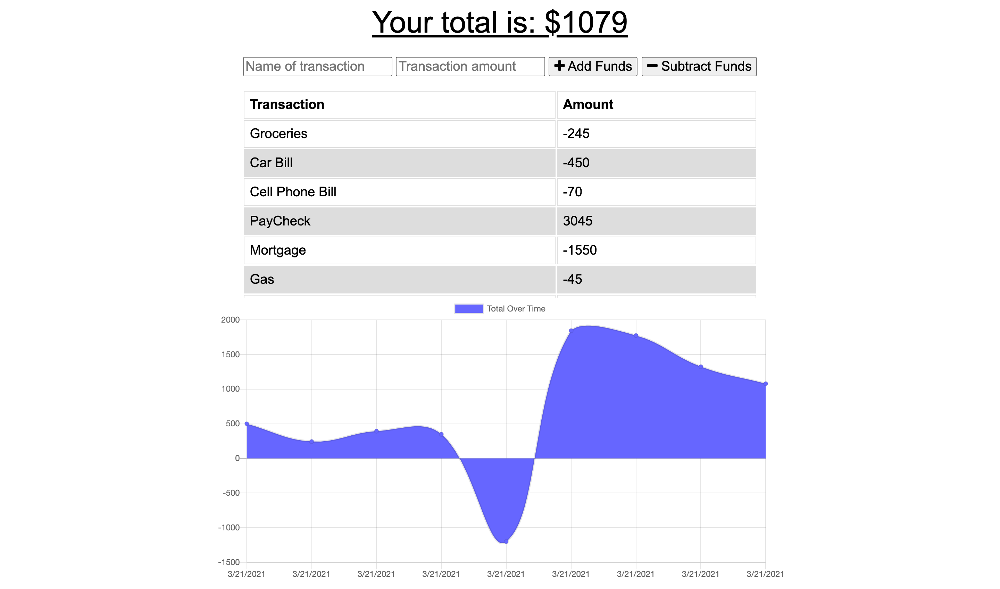

# Budget Tracker
  

## Description
Here we have a simple budget tracker progressive web application (PWA) that works offline and can be downloaded to your desktop or mobile device.
            
View the deployed page at [Budget Tracker](https://simple-budget-tracker-app.herokuapp.com/).

## Table of Contents
* [Installation](#Installation)
* [Usage](#Usage)
* [License](#License)
* [Application Screenshot](#Application-Screenshot)
* [Contribution](#Contribution)

## Installation
To install this application, clone the repo and run `npm i` in the command line to install dependencies.  Run `npm start` to start the Express.js server on `localhost:3001`.

## Usage
To use the budget tracker, simply provide a transaction name and transaction amount, then click "add funds" or "subtract funds".  To download the application to your desktop, click on the "Install Budget Tracker" icon found on the right-hand side of the address bar of your Google Chrome browser.

## License
This application is under the [ISC](https://opensource.org/licenses/ISC) license.

## Application Screenshot

## Contribution
* Built with much intrigue 🧐 and plenty of coffee ☕ by [Ruben Matamoros](https://github.com/valiantcreative33).
* Starter code provided by the [UCF Coding Boot Camp](https://github.com/coding-boot-camp/symmetrical-bassoon).